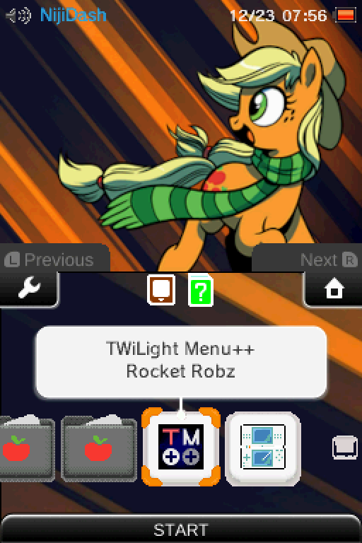

# Applejack Theme for Twilight Menu++

This skin is a port of the 'Applejack' theme originally made by Spagem for the 3DS. The theme features custom wallpapers and background music to keep the Pony spirit alive and kicking!

(3dsthem.es ID: 1114)

## Screenshots

| State | Screenshot | 
|---|---|
| App List |  |
| Background |  |
| Game Settings |  |

## Installation

On your SD card, navigate to `_nds/TWiLightMenu/3dsmenu/themes/` and drop the `Applejack` directory into that folder. 

On your DS/DSi/3DS, select the theme in Twilight Menu++'s settings by scrolling to `Theme` and pressing `A`. 

Make sure the setting `DSi/3DS Theme Music` is set to `Theme` for the full experience!

## Release Notes

| Version | Notes | 
|---|---|
| v1.0 | Customized shoulder buttons and dialog box |
| v0.5 | Initial Version |
