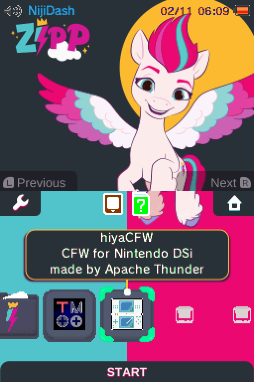
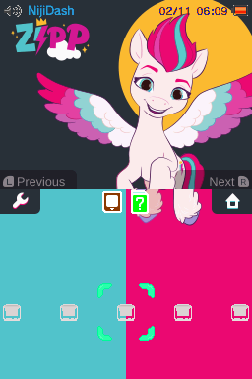
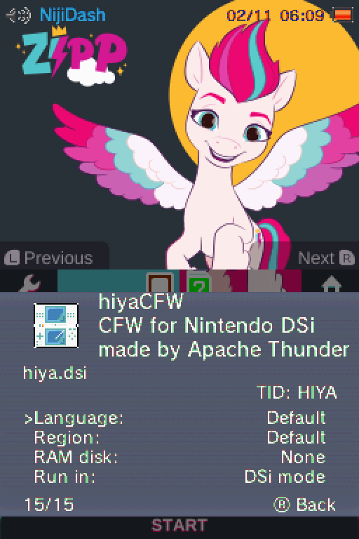

# Zipp Storm Theme for Twilight Menu++

Also known as Zephyrina Storm, this Zipp Storm theme is perfect for any fan of *My Little Pony: A New Generation*! 

## Disclaimer

I'm not affiliated to Hasbro in any way, shape or form. Zipp Storm vectors (Pony & Cutie Mark) by Hasbro.

## Screenshots

| State | Screenshot |
| --- | --- |
| App List |  |
| Background |  |
| Game Settings |  |

## Installation

On your SD card, navigate to `_nds/TWiLightMenu/3dsmenu/themes/` and drop the `ZippStorm` directory into that folder. 

On your DS/DSi/3DS, select the theme in Twilight Menu++'s settings by scrolling to `Theme` and pressing `A`. 

~~Make sure the setting `DSi/3DS Theme Music` is set to `Theme` for the full experience!~~ (No custom background music yet, please check later for a new version. Asked someone for permission!)

## Release Notes

| Version | Notes | 
|---|---|
| v1.0 | Initial Public Version |

## Nice-To-Have List

 - [ ] Background Music: Asked for permission, waiting on reply...
